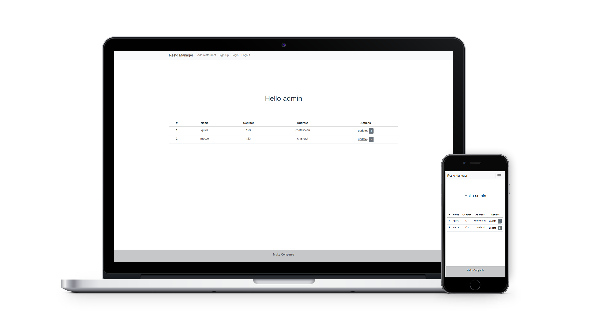

# vueRestoManager

a simple application that use an api to display and change informations

## Techno used

- [__Vue 3__](https://vuejs.org/) with vue-router and axios
- [__json-server__](https://www.npmjs.com/package/json-server)

## What's cool about it

- login / logout and register user
- routing
- api
- add / delete and update restaurant that are displayed in the home page

## What it looks like

